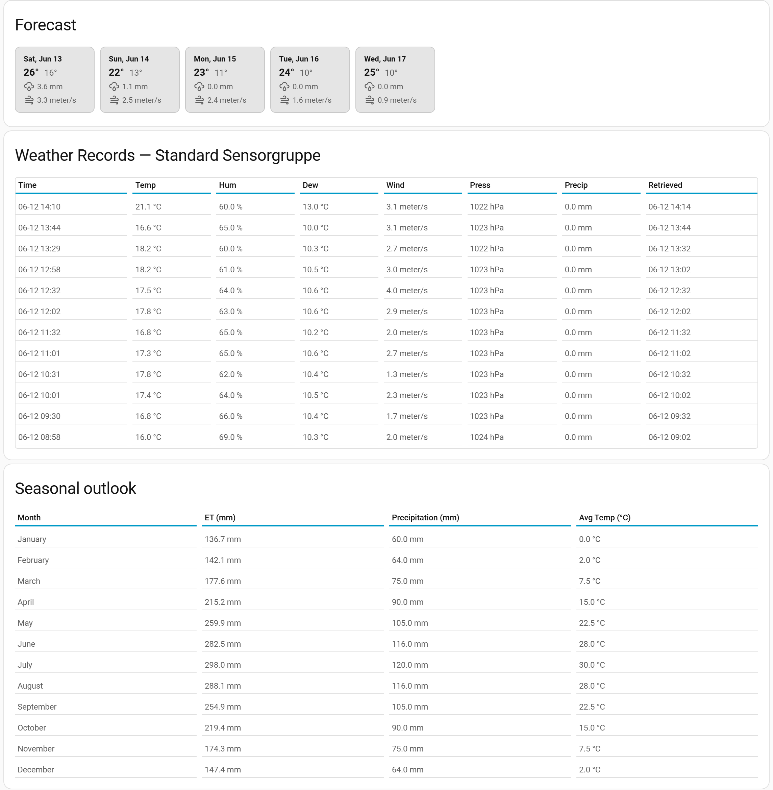

# Weather & Location

> Main page: [Configuration](configuration.md) 
> Next: [My Zones](configuration-my-zones.md)

The **Setup → Weather & Location** tab is where the integration learns about your weather: which service (or sensors) provide the data, where on earth you are, and what the weather looks like — now, the coming days, and across the year.

## Weather service

Choose whether to use a weather service and which one — **Open-Meteo** (free, no API key), **Open Weather Map**, or **Pirate Weather** — and manage the API key. A **Test** button validates the key before you save. This is the same choice you made [during installation](installation-weatherservice.md); you can change it here at any time.

If you disable the weather service, all weather data must come from your own sensors via [sensor groups](configuration-sensor-groups.md), and forecast-based features (the precipitation [skip condition](configuration-when-to-water.md#skip-conditions), PyETO forecast days, the forecast card below) are unavailable.

## Location coordinates

Your latitude, longitude and elevation, pre-filled from your Home Assistant home zone. The weather service fetches data for exactly this position, and the PyETO module uses latitude and elevation in its solar-radiation math — so if your HA home zone is somewhere else (or deliberately fuzzed), set the real irrigation site here.

Changes take effect after pressing **Save**, which reloads the integration (coordinates are baked into the weather clients at startup).

## Forecast

A card with the coming days from your weather service: minimum/maximum temperature, expected precipitation and wind speed. This is the same forecast data the precipitation skip condition evaluates.

## Weather records

The most recent weather readings collected for each [sensor group](configuration-sensor-groups.md) — one table per group, showing temperature, humidity, dewpoint, wind, pressure and precipitation with their timestamps. Use it to verify your sensors or weather service are actually delivering data before wondering why a calculation came out odd.

## Seasonal outlook

A 12-month climate estimate for your location: expected evapotranspiration, precipitation and average temperature per month. It answers "how much watering should I expect over the year" and is the replacement for the old per-zone watering calendar — climate is a property of your location, not of a zone, so it is shown once here.

Values are displayed in your Home Assistant unit system (metric or imperial).

> Main page: [Configuration](configuration.md) 
> Next: [My Zones](configuration-my-zones.md)
