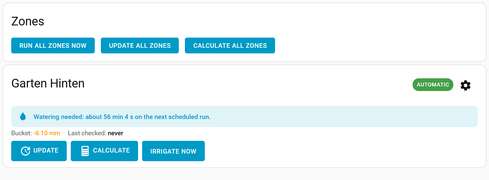

# Configuration

You configure the integration from the Smart Irrigation panel in the Home Assistant sidebar. Make sure you [install](installation.md) it first.

## First-run setup wizard

The first time you open the panel — or any time from **Setup → Setup wizard** — a guided wizard walks you through the four building blocks in order:

1. **Weather** — pick a weather service (Open-Meteo needs no API key) or choose to use your own sensors.
2. **Module** — the calculation module that turns weather into an irrigation duration (PyETO by default).
3. **Sensor group** — where each weather value comes from (the chosen weather service, a sensor, a static value, or none).
4. **Zone** — your first irrigation zone, optionally linked to a switch/valve entity.

When you finish, the wizard creates a fully wired, ready-to-calculate zone. You can re-run it any time to add more, or configure everything manually using the tabs below.

## The panel layout

The panel has two top-level areas:

- **Zones** — the everyday **dashboard**. For each zone it shows at a glance whether it will water and why, plus one-tap **Update**, **Calculate** and **Irrigate now**. A gear icon on each card jumps to that zone's settings. See [Zones](configuration-zones.md).
- **Setup** — everything you configure once and rarely touch, split into tabs:
  1. [General](configuration-general.md): update/calculation schedules, zone sequencing, skip conditions, location, and other global settings.
  2. [Zones](configuration-zones.md): add, edit and delete zones, link each to a switch/valve entity, and view per-zone weather data and the watering calendar.
  3. [Modules](configuration-modules.md): configure the calculation module (PyETO, Static, etc.).
  4. [Sensor groups](configuration-sensor-groups.md): configure which sensors or weather service provide weather data.
  5. [Schedules](configuration-schedules.md): create recurring schedules (daily, weekly, monthly, interval) — no automations needed.
  6. **Help**: links to this documentation and the community/issue trackers.